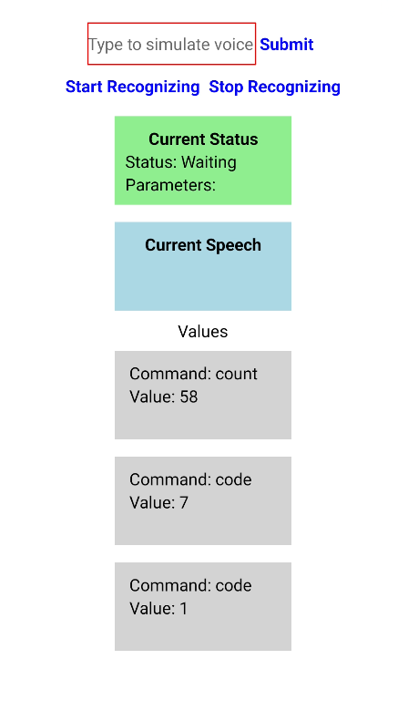

# Voice Inventory

Mobile app that detects voice commands and arguments.
`react-native`

## Expo

This app uses Expo and [Development Builds](https://docs.expo.dev/workflow/customizing/).
Native directories are left out of the Git repository, but they can be generated using `npx expo prebuild`.
Running the app using `npx expo run:[android|iOS]` does this automatically.

Note that running the app either requires Android Studio and the SDK, or Xcode and macOS.

Basic testing can be done using `expo start --[android|iOS]` but this uses the Expo Go app, which is not supported by the voice recognition library.

## Voice Recognition

The app uses [React Native Voice](https://github.com/react-native-voice/voice), licensed under MIT (open-source).

The library needs to be installed using `npm i @react-native-voice/voice --save`.

## How to Run

Commands in order:

- `npm i @react-native-voice/voice --save` (run once)
- `npx expo run:iOS`

## Language

The app supports language settings.
See `Language.tsx`

## Known Issues

- The voice recognition library occasionally detects sequences of numbers as one word. For example, "five seven" might be detected as "57", which is indistinguishable from "fifty-seven".
    - Workaround: say the digits slower.
- The voice recognition library might detect "two" as "too" or "to" depending on the accent of the user (because "count to" is a common phrase).
    - Possible fix: hardcode an exception.
- If "back" or "reset" is used, the Current Status might still display the previous command, while the correct state should be Waiting.
    - Possible fix: handle in textToCommands